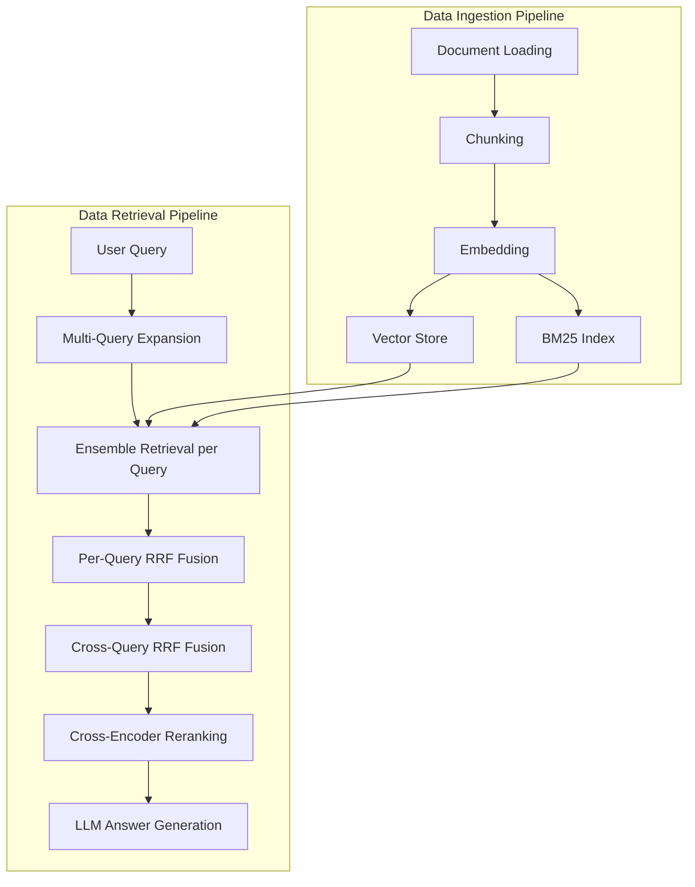

# RAG System Overview

This project implements a production-grade Retrieval-Augmented Generation (RAG) pipeline with dual-index retrieval, multi-query expansion, reciprocal rank fusion, and cross-encoder reranking.

## Architecture



## Quick Start

### 1. Install dependencies

```bash
python -m venv .venv
source .venv/bin/activate
pip install -r requirements.txt
```

### 2. Configure environment

```bash
cp .env.example .env
# Edit .env and set OLLAMA_URL only if using a remote Ollama server
# Ensure your local Ollama daemon is running and the selected model is available
```

### 3. Add documents

Place PDF, `.txt`, or `.md` files in `data/documents/` (sample included).

### 4. Ingest

```bash
python scripts/ingest.py
```

### 5. Query

```bash
python scripts/query.py "What is reciprocal rank fusion?"
python scripts/query.py "How does the retrieval pipeline work?" --sources
```

## Pipeline Details

### Ingestion (4 steps)

| Step | Module | Description |
|------|--------|-------------|
| 1 | `src/ingestion/loader.py` | Loads PDF, text, and markdown files |
| 2 | `src/ingestion/chunker.py` | Recursive character splitting with overlap |
| 3 | `src/ingestion/embedder.py` | Sentence-transformer dense embeddings |
| 4 | `src/ingestion/indexer.py` | Chroma vector store + BM25 sparse index |

### Retrieval (6 stages)

| Stage | Module | Description |
|-------|--------|-------------|
| 1 | `src/retrieval/query_expansion.py` | LLM generates query reformulations |
| 2 | `src/retrieval/ensemble.py` | Parallel vector + BM25 search |
| 3 | `src/retrieval/rrf.py` | Per-query RRF fusion of dense/sparse results |
| 4 | `src/retrieval/rrf.py` | Cross-query RRF fusion across all expansions |
| 5 | `src/retrieval/reranker.py` | Cross-encoder precision reranking |
| 6 | `src/generation/llm.py` | Grounded LLM answer synthesis |

## Configuration

All settings are in `.env` (see `.env.example`):

| Variable | Default | Purpose |
|----------|---------|---------|
| `OLLAMA_URL` |  | Optional Ollama server URL for remote inference |
| `OLLAMA_CHAT_MODEL` | qwen3:8b | Ollama model used for answer generation |
| `OLLAMA_EXPANSION_MODEL` | qwen3:8b | Ollama model used for query expansion |
| `OLLAMA_EMBEDDING_MODEL` | sentence-transformers/all-MiniLM-L6-v2 | Ollama embedding model (if enabled) |
| `EMBED_WITH_OLLAMA` | false | Whether to call Ollama for embeddings |
| `CHUNK_SIZE` | 512 | Characters per chunk |
| `CHUNK_OVERLAP` | 64 | Overlap between chunks |
| `NUM_QUERY_EXPANSIONS` | 3 | Alternative queries to generate |
| `RETRIEVAL_TOP_K` | 20 | Candidates per retriever per query |
| `RERANK_TOP_K` | 5 | Final chunks sent to LLM |
| `RRF_K` | 60 | RRF smoothing constant |
| `VECTOR_WEIGHT` | 0.7 | Relative weight of dense vector retrieval |
| `BM25_WEIGHT` | 0.3 | Relative weight of BM25 sparse retrieval |

## Project Structure

```
RAG-Project/
├── src/
│   ├── ingestion/       # Loading, chunking, embedding, indexing
│   ├── retrieval/       # Query expansion, ensemble, RRF, reranking
│   ├── generation/      # LLM answer generation
│   ├── config.py        # Settings from .env
│   ├── models.py        # Shared data models
│   └── rag.py           # End-to-end pipeline
├── scripts/
│   ├── ingest.py        # CLI: build the knowledge base
│   └── query.py         # CLI: ask questions
├── data/documents/      # Your source documents
└── .index/              # Generated indexes (gitignored)
```
