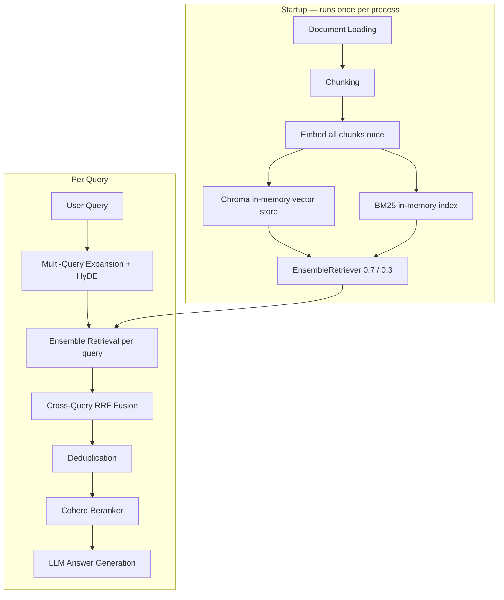

# RAG System Overview

A Retrieval-Augmented Generation (RAG) pipeline with hybrid search, multi-query expansion, reciprocal rank fusion, and cross-encoder reranking. No separate ingestion step — documents are loaded, chunked, and indexed in memory every time you run a query.

## Architecture



## Quick Start

### 1. Install dependencies

```bash
python -m venv .venv
source .venv/bin/activate
pip install -r requirements.txt
```

### 2. Configure environment

```bash
cp .env.example .env
# Edit .env — set your Cohere API key and ensure Ollama is running locally
```

### 3. Add documents

Place PDF, `.txt`, or `.md` files in `data/documents/`.

### 4. Query

```bash
# Single question
python scripts/query.py "What is reciprocal rank fusion?"

# With sources
python scripts/query.py "How does the retrieval pipeline work?" --sources

# Interactive mode
python scripts/query.py -i
```

That's it. No separate ingest step. On startup the pipeline loads your documents, chunks them, embeds all chunks once, and builds the retrievers — then answers your question.

## Pipeline Details

### Startup (runs once, inside `RAGPipeline.__init__`)

| Step | Module | Description |
|------|--------|-------------|
| 1 | `src/ingestion/loader.py` | Loads PDF, text, and markdown files from `data/documents/` |
| 2 | `src/ingestion/chunker.py` | `RecursiveCharacterTextSplitter` splits docs into chunks |
| 3 | `src/ingestion/embedder.py` | HuggingFace sentence-transformer embeds all chunks once |
| 4 | `src/rag.py` | Chroma vector store + BM25 retriever built in memory, wrapped in `EnsembleRetriever` |

### Per Query (inside `RAGPipeline.query`)

| Stage | Module | Description |
|-------|--------|-------------|
| 1 | `src/retrieval/query_expansion.py` | Ollama generates N query rephrasings + one HyDE hypothetical document |
| 2 | `src/rag.py` | `EnsembleRetriever.invoke()` per expanded query (vector 0.7 + BM25 0.3) |
| 3 | `src/retrieval/rrf.py` | Cross-query RRF fusion merges all per-query ranked lists into one |
| 4 | `src/retrieval/dedup.py` | Drops near-duplicate chunks (cosine similarity >= 0.95) |
| 5 | `src/retrieval/reranker.py` | Cohere cross-encoder reranks candidates against original query |
| 6 | `src/generation/llm.py` | Ollama generates grounded answer with [1][2] citations |

## Configuration

All settings are in `.env` (see `.env.example`):

| Variable | Default | Purpose |
|----------|---------|---------|
| `OLLAMA_URL` | | Optional remote Ollama server URL (leave blank for local) |
| `OLLAMA_CHAT_MODEL` | qwen3:8b | Model used for answer generation |
| `OLLAMA_EXPANSION_MODEL` | qwen3:8b | Model used for query expansion and HyDE |
| `HF_EMBEDDING_MODEL` | BAAI/bge-large-en-v1.5 | HuggingFace model used for embeddings |
| `COHERE_API_KEY` | | Required for reranking |
| `COHERE_RERANK_MODEL` | rerank-english-v3.0 | Cohere reranking model |
| `CHUNK_SIZE` | 1024 | Characters per chunk |
| `CHUNK_OVERLAP` | 128 | Overlap between adjacent chunks |
| `NUM_QUERY_EXPANSIONS` | 3 | Number of alternative queries to generate |
| `RETRIEVAL_TOP_K` | 20 | Candidates returned per retriever per query |
| `RERANK_TOP_K` | 15 | Final chunks passed to the LLM |
| `RRF_K` | 60 | RRF smoothing constant |
| `VECTOR_WEIGHT` | 0.7 | Weight for dense vector retrieval |
| `BM25_WEIGHT` | 0.3 | Weight for BM25 sparse retrieval |

## Project Structure

```
RAG-Project/
├── src/
│   ├── ingestion/
│   │   ├── loader.py           # PDF, txt, md document loading
│   │   ├── chunker.py          # Recursive character splitting
│   │   └── embedder.py         # HuggingFace sentence-transformer embeddings
│   ├── retrieval/
│   │   ├── query_expansion.py  # Multi-query + HyDE via Ollama
│   │   ├── rrf.py              # Reciprocal rank fusion
│   │   ├── dedup.py            # Near-duplicate removal
│   │   └── reranker.py         # Cohere cross-encoder reranking
│   ├── generation/
│   │   └── llm.py              # Ollama answer generation with citations
│   ├── config.py               # Settings loaded from .env
│   ├── models.py               # Shared dataclasses (DocumentChunk)
│   └── rag.py                  # End-to-end pipeline — startup + query
├── scripts/
│   └── query.py                # CLI entrypoint
└── data/documents/             # Place your source documents here
```

## Notes

- **No persistent index.** Vectors and BM25 index live in memory for the duration of the process. Startup time scales with the number and size of your documents.
- **Ollama must be running locally** (or set `OLLAMA_URL` for a remote instance) before running any queries.
- **Cohere API key is required** for reranking. Without it the pipeline will error at Stage 5.
